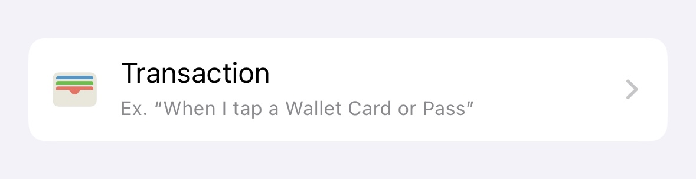
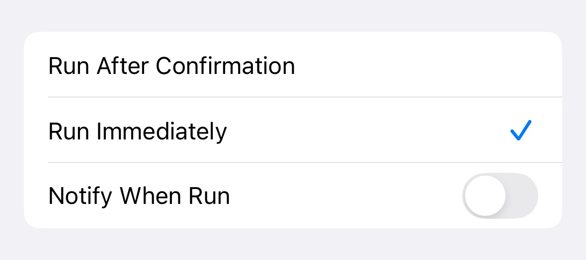
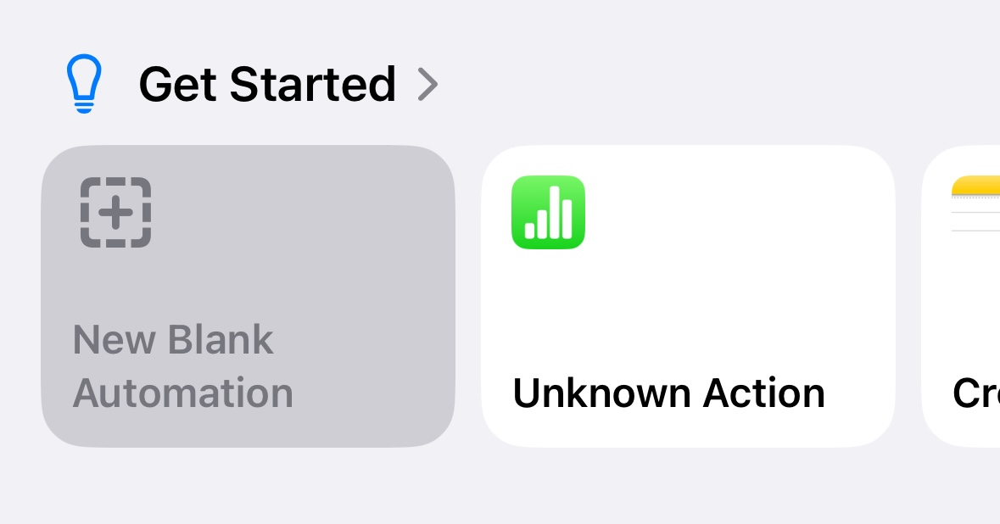
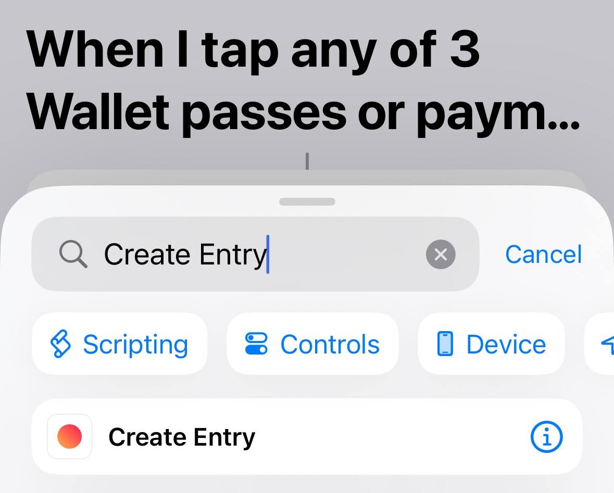
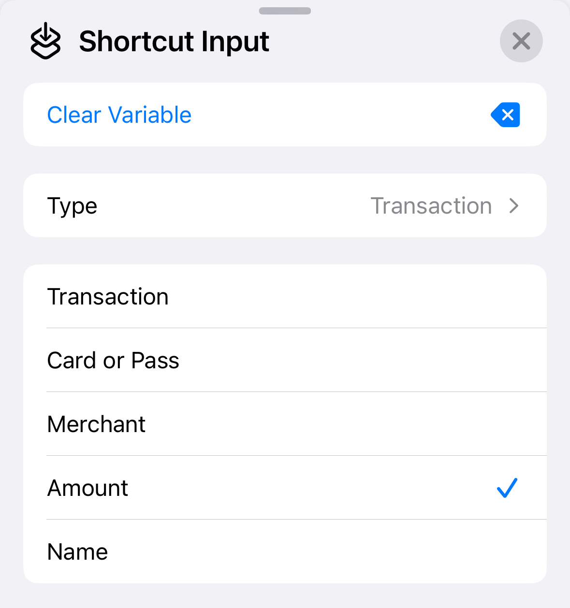
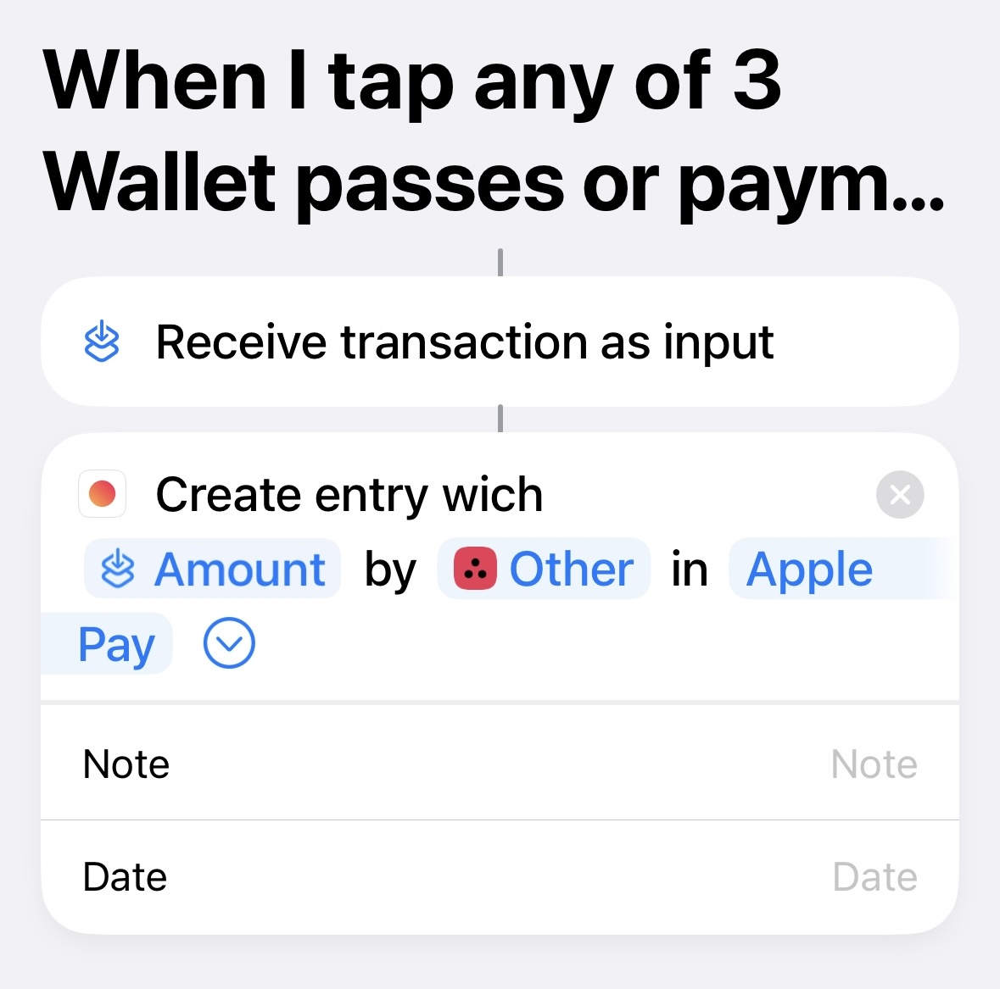

# Automatically add Apple Pay transactions to Axia

In iOS 17, Apple has introduced a new feature called [Transaction Triggers](https://support.apple.com/en-al/guide/shortcuts/apd65c67538a/ios) in the Apple Shortcuts app. This feature allows you to automatically execute any shortcut after making a purchase using Apple Pay. This tutorial will help you set up automatic addition of Apple Pay transactions in Axia.

Here's how to set it up:
- Create a new automation by opening the Apple Shortcuts app and tapping the "Automations" tab. Press the "+" button to add a new automation and select "Transaction".

- On the next screen, select "Run Immediately" at the bottom of the screen to avoid having to manually confirm automation. Tap the "Next" button to continue.

- Select "New Blank Automation".

- Search for the "Create Entry" action and select it.

- In the "Amount" field, tap "Select Variable", and choose "Shortcut Input". Then we need to tap "Shortcut Input" again to customize how much of it will be passed to the shortcut. Here you need to select the "Amount" value. 

- Now the rest of the fields such as "Category", "Account" and others can be filled in as you wish.

- Now your automation is set up properly. Just tap "Done", and you're all set.
