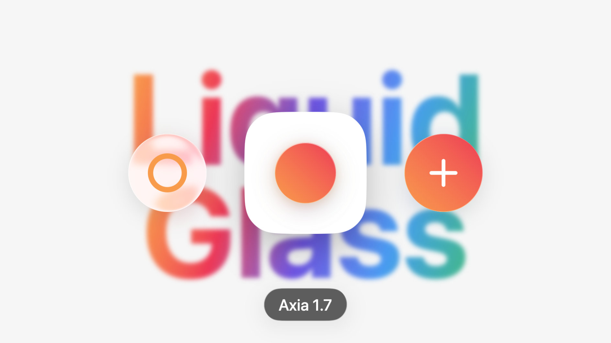
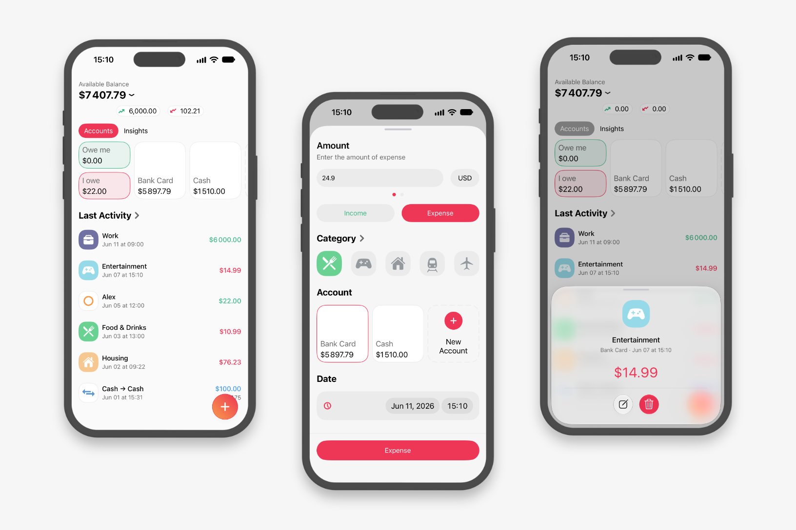
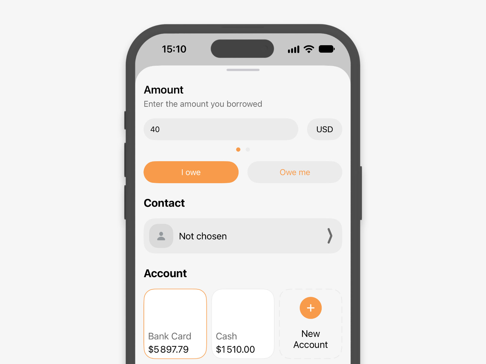
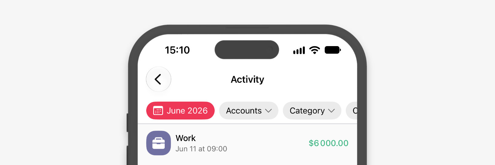
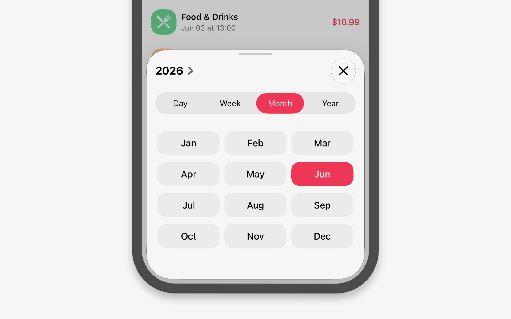

# Что нового в Axia 1.7

В Axia 1.7 мы обновили интерфейс в стиле Liquid Glass, научили приложение вести долги, переработали «Настройки», добавили фильтры в «Активность» и сделали много других улучшений.



## Свежо и прозрачно

Мы перерисовали каждый экран и каждую иконку. Заметнее всего это в мелочах: скругления стали крупнее, палитра — спокойнее, а предпросмотр активности мягко размывает экран под собой. На наш взгляд, Axia ещё никогда не выглядела так легко.



«Настройки» не просто сменили внешний вид — мы пересобрали их с нуля. Ориентироваться в них стало проще, а возможностей — больше.

```tabs
Было | media/settings-old.jpg
*Стало | media/settings-new.jpg
```

Первое, ради чего сюда стоит зайти, — резервная копия: выгрузите все данные в JSON и загрузите обратно, когда понадобится. Там же выбирается период, за который Axia считает итоги, — день, неделя, месяц или год. А тему теперь можно задать отдельно от системной: держите Axia светлой, даже если весь телефон тёмный.

В самом низу «Настроек» мы собрали ссылки на наши соцсети — подписывайтесь, чтобы первыми узнавать о новом в Axia.

## Кто кому должен

Одолжили другу до зарплаты и забыли? Теперь за вас помнит Axia. Создайте долг, выберите «Я должен» или «Мне должны», укажите сумму, счёт и человека.



Добавьте человека прямо в приложении или возьмите из «Контактов». Карточки «Я должен» и «Мне должны» на главном экране показывают итог и баланс по каждому. Если вы одалживали в разных валютах, Axia покажет каждую отдельно и сведёт всё в основную.

## Фильтры и периоды в «Активности»

Фильтруйте активность по счёту, категории и валюте. Коснитесь счёта на главном экране или категории в аналитике, и Axia сразу откроет «Активность» с нужным фильтром.



Окно выбора периода мы собрали заново: переключатель «День / Неделя / Месяц / Год», а под ним — сами периоды. Выбрать нужный или перескочить на соседний теперь можно одним касанием.



## И ещё

- **Иконки категорий.** Стали векторными и остаются чёткими на любом экране. Мы нарисовали 11 новых: банк, барбершоп, мозг, здание, кофейное зерно, фейерверк, шестерёнку, гору, попкорн, пазл, гаечный ключ с отвёрткой.
- **Порядок счетов.** Перетаскивайте счета, как вам удобно. Балансы Axia считает по самим активностям, поэтому они всегда сходятся со списком.
- **Переводы между валютами.** Axia сама пересчитает сумму по курсу.
- **Калькулятор.** Копируйте и вставляйте сумму.
- **Аналитика.** Линия среднего на графике подскажет, где вы вышли за привычные траты.
- **Виджет.** Курсы валют прямо на экране «Домой».
- **Быстрые команды.** Новое действие — «Конвертация валюты». В автоматизациях Apple Pay Axia сама подберёт категорию по названию продавца.
- **Пять новых языков.** Немецкий, французский, португальский, турецкий и традиционный китайский. Названия валют мы тоже перевели на все языки.

В 1.7 мы вложили больше, чем в любое обновление до неё. Надеемся, вам понравится.

---

:::site
Обновите Axia в [App Store](https://apps.apple.com/app/apple-store/id1492998632?pt=119949465&ct=journal&mt=8), нужна iOS 17 или новее. Новый интерфейс в стиле Liquid Glass доступен на iOS 26 и новее.
:::

:::app
<div class="fineprint">

Больше историй об Axia читайте в нашем блоге.

[Перейти в блог](https://journal.patarov.com)

</div>
:::
